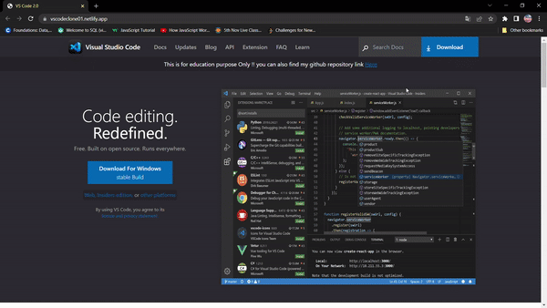

<h3 align="center">VS Code Clone Using Pure HTML & Tailwind CSS <a href="https://vscodeclone01.netlify.app/">
    
VS CODE CLONE</a></h4>

<p align="center">
    
    
</P>



## How To Use

To clone and run this application, you'll need [Git](https://git-scm.com) and [Node.js](https://nodejs.org/en/download/) (which comes with [npm](http://npmjs.com)) installed on your computer. From your command line:

```bash
# Clone this repository
$ git clone https://github.com/Parmeshwaryadav/VS-Code-2.0.git

# Go into the repository
$ cd VS CODE WEBPAGE 2.0

```

## Credits

this project was assigned by inueron Team.
This webpage is purely build for educational Purpose.

<!-- ## You may also like...

- []() -  -->
